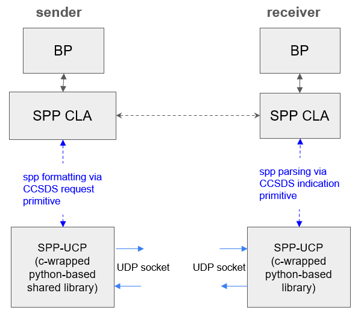

# SPP-UCP - A CCSDS Space Packet Protocol Implementation with an UDP-based Communication Provider

12/13/2024

## Introduction

This repository contains the source code for the SPP-UCP project, which is a CCSDS Space Packet Protocol (SPP) implementation as an Underlying Communication Provider (UCP) designed to run under Bundle Protocol v7 to test the SPP CLA implementation according to Annex B of the CCSDS Bundle Protocol Version 7 Orange Book.

The SPP CLA specification recommends that the Octet_String service for SPP be used:

```text
OCTET_STRING.request (Octet String, APID, Secondary Header Indicator, Packet Type, Packet Sequence Count/Packet Name) 

OCTET_STRING.indication (Octet String, APID, Secondary Header Indicator, Data Loss Indicator (optional))
```

The bundle size should be no more than 65,536 bytes, and the following shall apply:

- One CBOR-encoded Bundle per Space Packet - generated by CLA
- APID depends on the link destination - provided by CLA, as determined by the CLA's peer identity
- No secondary packet header - always set to false (or 0)
- Only use packet sequence counter - provided by CLA, which will increment from 0 and go up indefinitely
- Loss indicator - provided by SPP when noticing a gap in sequence number.

## SPP CLA Prototype Design for ION

Unlike TCPCLA and UDPCLA, which have well-known APIs for packaging data into TCP stream and UDP datagrams, there are no standard APIs for invoking SPP service. Those API would be implementation specific.

Therefore, in order to build a SPP CLA, we need to build a simple SPP provider; otherwise there is nothing for the SPP CLA to interact with. In reality, the SPP provider should be externally implemented and then integrated into ION.

With that in mind, we design the SPP CLA prototype in ION with the following in mind:

1. The simple SPP provider should be portable for testing over a wide range of testing environment. 
2. The simple SPP provider should offers API matching the service primitive of SPP implementation conforming to CCSDS Bluebook.
3. We want to make sure the prototype CLA is interfaced with the simple SPP provider in such as way that it is fairly straight forward to _swap_ it out.
4. We want to avoid baking in any particular Interprocess Communication between the CLA and an externally sourced SPP provider software. The simple SPP provider will be available through a small set of library functions that performs only the formatting and parsing of SPP. We rely on the SPP CLA to provide a UDP-based delivery mechanism between two DTN nodes.
   - Should a future SPP provider have an interface with the lower layer (e.g., CCSDS frames or spacecraft/ground station comm systems), then the UDP-delivery mechanism in the CLA can be either removed, disable, or bypassed.



## Install Dependencies

The Space Packet Protocol provider library is based on the `spacepackets` [python package](https://pypi.org/project/spacepackets/), which requires python version >= 3.9. Check the version:

```bash
python3 --version
```

If you don't want to upgrade to higher python version, please install and enable a higher version (but not as default.) Example in RHEL:

```bash
sudo dnf module enable python39
sudo dnf install python39
```

This will install Python 3.9 as /usr/bin/python3.9 without affecting the default /usr/bin/python3 (Python 3.6).

Check python version again. Sometimes this may upgrade to a different version. In the RHEL8 example, the python version was actually upgraded to 3.12.

It might be a good idea to set up python virtual environment using required python version. For example, if the only python version on the host higher than 3.9 is 3.12, then use it to create the python environment, which will make it the default version in that environment.

```bash
# In your home directory, create virtual environment
python3 -m venv SPPUCPENV
```

Activate virtual environment:

```bash
source ./SPPUCPENV/bin/activate
```

* You can deactivate the virtual environment by `deactivate`.

To build actual CCSDS Space Packets, we use the `spacepackets` python package. See [documentation.](https://spacepackets.readthedocs.io/en/latest/examples.html)

Within the new virtual environment, `python` (without the '3') should simply default to the python3 version you used to create the environment. You can also verify by path that the `python` command is now running within the environment:

```bash
python --version
which python
```

Now check if the `spacepackets` package is installed:

```bash
python -c "import spacepackets; print('Module found')"
```

If you see the message "Module found", then the package is installed. If not, you need to install it. If not, install the `spacepackets` package using pip: 

```bash
python -m pip install spacepackets
```

## Testing the Python `spacepackets` package

The `send_space_packet_udp.py` script will construct a spacepacket and send it via UDP. The `recv_space_packet_udp.py` script will receive a packet over UDP, parse it, and display its content.

Start the receive script:

```bash
cd python
python recv_space_packet_udp.py 127.0.0.1 5000
```

Send a spacepacket with APID 250, sequence count 1, payload "01020304" to localhost on port 5000. Make sure the receive script is running before sending the packet.

```bash
cd python
python send_space_packet_udp.py --apid 250 --seq_count 1 --payload "01020304" 127.0.0.1 5000
```

## Testing the C Space Packet Library

To access space packet from C, we need to install the `space_packet_module` python module we created:

``` bash
cd ./space_packet_module
python -m pip install .
```

Confirm it is installed by running the following command from inside the virtual environment where the module is installed:

```bash
# Go to a different directory and run:
python -c "import space_packet_module; print('Module found')"
```

Install the Python C development package in order to  build the C wrapper functions for python:

This must be install on the host so you need to specify the exact version. So you need to specify python3.11-dev instead of just python3-dev.

Again, from inside the virtual environment where the module is installed, run `python --version` to confirm the actual version of python in the virtual environment. For example if it is 3.12, then install the development package specific to that version:

For Ubuntu
```bash
sudo apt-get update
sudo apt-get install python3.12-dev
```

For MacOS
```bash
brew install python@3.12
```
Note: installing  python@3.12 will install its related development packages.

For RHEL8:
```bash
sudo subscription-manager repos --enable codeready-builder-for-rhel-8-$(arch)-rpms
sudo dnf module enable python:3.12
sudo dnf install python3.12 python3.12-devel
```

Confirm Python include path:
For  Ubuntu:
```bash
python3.12-config --includes
python3.12-config --ldflags
```

For MacOS:
```bash
python3.12-config --includes
python3.12-config --ldflags
```

Verify installation of the development header:

For Ubuntu:
```bash
ls /usr/include/python3.12/Python.h
```

Take note if the `-lpython3.12` is part of the include flag output. If not, make sure the shared library is avilable:

```bash
find /usr -name "libpython3.12.so"
```

If it is available, then you just have to manually add the flag to the compiler.

### Build the Test C Program

The C test programs for Space Packet are `spptx.c` and `spprx.c`. You can buidl them this way: 

```bash
# Go to "src" folder
# Build the transmit program: spptx
gcc -g -o spptx spptx.c space_packet_sender.c $(python3.12-config --includes) $(python3.12-config --ldflags) $(python3.12-config --libs) -lpython3.12

# Build the receiving program: spprx
gcc -g -o spprx spprx.c space_packet_receiver.c
```
### Running The Test Programs

Start the receiver to liste at 127.0.0.1:5000:
`./spprx 127.0.0.1 5000`

Start the sender to send space packet to 127.0.0.1:5000 with APID of 250, type 1 space packet, no secondary header ('0'), and a maximum payload of 10 bytes:
`./spptx 127.0.0.1 5000 250 1 0 10`

You can also build the `spptxpipe` program - a modified version of `spptx` that allows you to pipe data in the following fashion:

```bash
gcc -g -o spptxpipe spptxpipe.c space_packet_sender.c $(python3.12-config --includes) $(python3.12-config --ldflags) $(python3.12-config --libs) -lpython3.12
```

Run it:
```bash
cat hex_payload.txt | ./spptxpipe <IP> <PORT> <APID> <TYPE> <SEC_FLAG> <Payload Size>
```


## Using the CMake build system

We have updated the prototype of the build_space_packet call a little bit, try to see if that affects the CMake build.

### Build the Project

```bash
mkdir build && cd build
cmake ..
make
```
### Run the Test

```bash
ctest --output-on-failure
```


